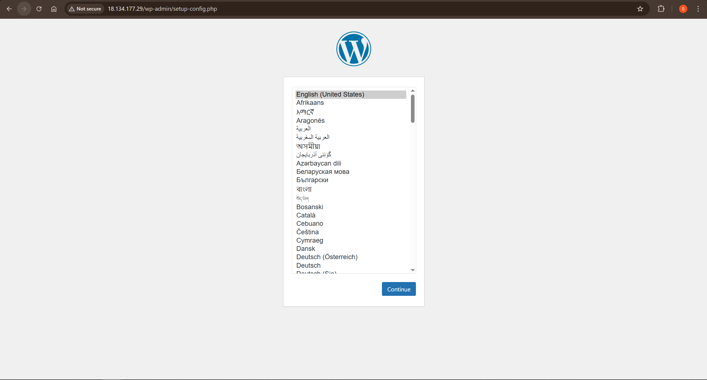

# WordPress Site on AWS - Terraform Deployment

This project demonstrates a complete Terraform infrastructure setup for deploying a WordPress site on AWS. It provisions all necessary AWS resources including VPC, networking components, EC2 instance, and security groups, with automated WordPress installation via user data scripts.

## 📋 Table of Contents

- [Architecture](#architecture)
- [Prerequisites](#prerequisites)
- [Project Structure](#project-structure)
- [Setup Instructions](#setup-instructions)
- [Configuration](#configuration)
- [Deployment](#deployment)
- [Accessing WordPress](#accessing-wordpress)
- [Outputs](#outputs)
- [Cleanup](#cleanup)
- [Screenshots](#screenshots)

## 🏗️ Architecture

This Terraform configuration creates:

- **VPC**: Custom Virtual Private Cloud with CIDR block `10.0.0.0/16`
- **Public Subnet**: Subnet with public IP assignment enabled
- **Internet Gateway**: Enables internet access for the VPC
- **Route Table**: Routes traffic from the subnet to the internet gateway
- **EC2 Instance**: Ubuntu-based instance running WordPress
- **Security Group**: Allows inbound HTTP (port 80) traffic from anywhere

The WordPress installation is automated via a user data script that:
- Installs Apache, MySQL, PHP, and required dependencies
- Downloads and configures WordPress
- Sets up the web server

## 📦 Prerequisites

Before deploying this infrastructure, ensure you have:

1. **AWS Account** with appropriate permissions
2. **AWS CLI** configured with credentials
   ```bash
   aws configure
   ```
3. **Terraform** installed (version 1.0+)
   - Download from [terraform.io](https://www.terraform.io/downloads)

## 📁 Project Structure

```
wordpress-site/
├── main.tf                 # Root module configuration
├── variables.tf            # Root module variables
├── outputs.tf              # Root module outputs
├── provider.tf             # AWS provider configuration
├── terraform.tfvars        # Variable values (create from example)
├── terraform.tfvars.example # Example variable file
├── README.md               # This file
├── scripts/
│   └── user_data.sh        # EC2 user data script for WordPress installation
└── modules/
    ├── vpc/
    │   ├── main.tf         # VPC, subnet, IGW, route table resources
    │   ├── variables.tf    # VPC module variables
    │   └── outputs.tf      # VPC module outputs
    └── ec2/
        ├── main.tf         # EC2 instance and security group
        ├── variables.tf    # EC2 module variables
        └── outputs.tf      # EC2 module outputs
```

## 🚀 Setup Instructions

1. **Clone or navigate to the project directory**
   ```bash
   cd terraform/wordpress-site
   ```

2. **Create your `terraform.tfvars` file**
   ```bash
   cp terraform.tfvars.example terraform.tfvars
   ```

3. **Edit `terraform.tfvars` with your values**
   ```hcl
   ami_id = "ami-0a0ff88d0f3f85a14"  # Ubuntu AMI for eu-west-2
   instance_type = "t2.micro"         # Free tier eligible
   ```
   
   **Note**: The AMI ID is region-specific. For other regions:
   - Find Ubuntu AMI IDs at: https://cloud-images.ubuntu.com/locator/ec2/
   - Or use AWS Console: EC2 → Launch Instance → Ubuntu Server

4. **Initialize Terraform**
   ```bash
   terraform init
   ```

5. **Review the execution plan**
   ```bash
   terraform plan
   ```

6. **Apply the configuration**
   ```bash
   terraform apply
   ```
   
   Type `yes` when prompted to confirm.

## ⚙️ Configuration

### Variables

| Variable | Description | Type | Required | Default |
|----------|-------------|------|----------|---------|
| `ami_id` | AMI ID for the EC2 instance | `string` | Yes | - |
| `instance_type` | EC2 instance type | `string` | Yes | - |

### VPC Module Variables (with defaults)

- `vpc_cidr`: VPC CIDR block (default: `10.0.0.0/16`)
- `public_subnet_cidr`: Public subnet CIDR (default: `10.0.1.0/24`)
- `default_route_cidr`: Default route CIDR (default: `0.0.0.0/0`)

### Region Configuration

The AWS region is currently set to `eu-west-2` (London) in `provider.tf`. To change:

```hcl
provider "aws" {
    region = "us-east-1"  # Change to your preferred region
}
```

**Remember**: Update the `ami_id` in `terraform.tfvars` to match your region!

## 🚢 Deployment

After running `terraform apply`, the deployment typically takes 3-5 minutes:

1. **VPC resources** are created first
2. **EC2 instance** launches and runs the user data script
3. **WordPress installation** completes automatically

Monitor the instance initialization:
```bash
# Get instance ID from outputs
terraform output instance_id

# Check instance status (requires AWS CLI)
aws ec2 describe-instance-status --instance-ids <instance-id>
```

## 🌐 Accessing WordPress

1. **Get the public IP address**
   ```bash
   terraform output instance_public_ip
   ```

2. **Open in your browser**
   ```
   http://<public-ip>
   ```

3. **WordPress Setup**
   - You'll see the WordPress installation wizard
   - Complete the setup with your preferred language, site title, admin credentials, etc.

4. **Verify Installation**
   - Check for `/BOOTSTRAP_OK.txt` file to confirm user data script executed:
     ```
     http://<public-ip>/BOOTSTRAP_OK.txt
     ```

## 📤 Outputs

After deployment, Terraform outputs:

- `instance_id`: The EC2 instance ID
- `instance_public_ip`: The public IP address of the WordPress site
- `vpc_id`: The VPC ID
- `subnet_id`: The public subnet ID

View all outputs:
```bash
terraform output
```

## 🧹 Cleanup

To destroy all resources and avoid AWS charges:

```bash
terraform destroy
```

Type `yes` when prompted. This will:
- Terminate the EC2 instance
- Delete the security group
- Remove VPC, subnet, IGW, and route table

**Note**: Ensure you've backed up any WordPress data before destroying!

## 📸 Screenshots

### WordPress Installation Page



The WordPress installation wizard is accessible after deployment, showing the language selection page. This confirms successful deployment and that the site is ready for configuration.

## 🔒 Security Considerations

- **Security Group**: Currently allows HTTP (port 80) from anywhere (`0.0.0.0/0`)
- **SSH Access**: Not configured by default (add if needed for troubleshooting)
- **HTTPS**: Consider adding SSL/TLS certificate (Let's Encrypt) for production
- **Database**: MySQL is installed locally on the instance
  - For production, consider using RDS for better security and scalability

## 📝 Notes

- This setup uses a single EC2 instance (not highly available)
- Database is local to the instance (not suitable for production)
- Public IP may change on instance restart (consider Elastic IP for production)
- Free tier eligible if using `t2.micro` in supported regions

## 🎓 Learning Objectives

This project demonstrates:
- ✅ Terraform module structure and organization
- ✅ AWS VPC and networking components
- ✅ EC2 instance provisioning
- ✅ Security group configuration
- ✅ User data scripts for automation
- ✅ Terraform variables and outputs
- ✅ Infrastructure as Code best practices